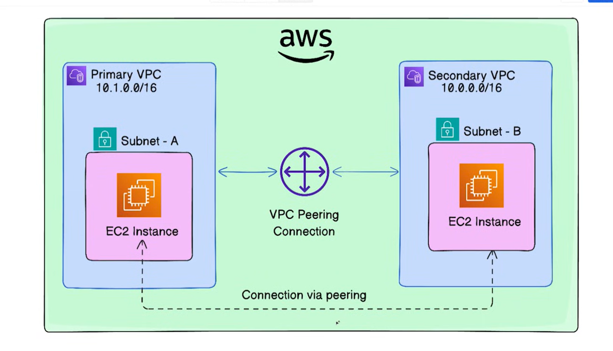
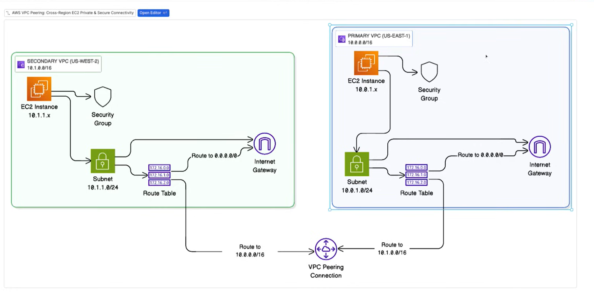
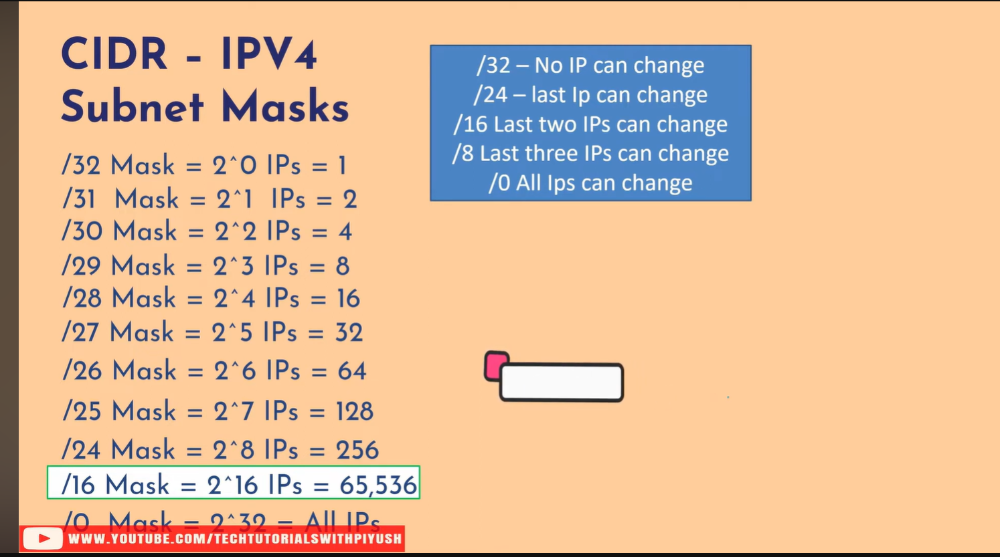

# VPC Peering — Detailed Notes

## Overview

This document explains the VPC peering example in this folder. It covers the architecture, the Terraform resources in `main.tf`, the AWS CLI command used to create an EC2 key pair, how to use the generated `.pem` file, and security/cleanup recommendations.

---

## Architecture diagram

Below are the diagrams kept in this folder illustrating the cross-region VPC peering setup. Use them to visualise how VPCs, subnets, route tables, internet gateways, and EC2 instances are connected.

- Primary diagram: 
- Route table illustration: 
- CIDR reference: 

---

## High-level flow

- Two VPCs are created: a `primary` and a `secondary` VPC (different regions/providers configured).
- Each VPC has a subnet and an internet gateway with a public route (0.0.0.0/0).
- A VPC Peering connection is created from the primary to the secondary, and the secondary accepts the peering connection.
- Each VPC's route table includes a route that sends traffic destined for the other VPC's CIDR via the peering connection.
- Security groups are configured to allow SSH and cross-VPC traffic for testing connectivity.
- An EC2 instance is launched in each VPC using AMIs from the appropriate region and using key pairs for SSH access.

---

## Explanation of Terraform resources (from `main.tf`)

All resource names below correspond to the resources defined in `main.tf` in this folder.

- `aws_vpc.primary_vpc` / `aws_vpc.secondary_vpc`
  - Creates two VPCs using the CIDR blocks defined in variables `primary_vpc_cidr` and `secondary_vpc_cidr`.
  - `enable_dns_support` and `enable_dns_hostnames` are enabled to allow DNS names for EC2 instances.

- `aws_subnet.primary_subnet` / `aws_subnet.secondary_subnet`
  - Each VPC receives a subnet. In this example the subnet CIDR equals the VPC CIDR for simplicity (adjust for production).
  - `map_public_ip_on_launch = true` configures instances in the subnet to receive public IPs at launch.

- `aws_internet_gateway.primary_igw` / `aws_internet_gateway.secondary_igw`
  - Attaches an Internet Gateway to each VPC so instances can reach the internet (and be reached if security rules permit).

- `aws_route_table.primary_rt` / `aws_route_table.secondary_rt`
  - Route tables with a route to `0.0.0.0/0` via the attached Internet Gateway. Associates of these route tables send public traffic to the IGW.

- `aws_route_table_association.primary_rta` / `aws_route_table_association.secondary_rta`
  - Associates the route tables with the created subnets so the routes apply to the instances in those subnets.

- `aws_vpc_peering_connection.primary_to_secondary`
  - Creates the VPC peering request in the primary region/provider. Note `auto_accept = false` — the request must be accepted by the peer.
  - `peer_region` is provided for cross-region peering.

- `aws_vpc_peering_connection_accepter.secondary_to_primary`
  - Executed in the secondary provider; accepts the peering connection. `auto_accept = true` is used here to accept the incoming request.

- `aws_route.primary_to_secondary_route` / `aws_route.secondary_to_primary_route`
  - Adds routes in each VPC route table that direct traffic for the other VPC's CIDR block to the appropriate peering connection resource ID.
  - These are required to enable cross-VPC routing for private addresses.

- `aws_security_group.primary_sg` / `aws_security_group.secondary_sg`
  - Allow SSH (TCP/22) from anywhere (easy for demos; restrict in production).
  - Allow ICMP and specific TCP ranges from the peer VPC CIDR so instances can ping and communicate across the peering link.
  - Egress allows outbound traffic to 0.0.0.0/0.

- `aws_instance.primary_instance` / `aws_instance.secondary_instance`
  - Launch one EC2 instance in each subnet. The instances use `vpc_security_group_ids` and `key_name` variables for SSH access.
  - `depends_on` is used to ensure peering exists (or is accepted) before instance creation where needed for orchestration.

Notes:
- Cross-region peering does not support transitive routing. If you have a third VPC, traffic will not pass through this peering connection unless explicitly routed and supported.
- Security group rules in each VPC must reference the other VPC's CIDR (or instance IPs) to permit traffic across the peering connection.

---

## The AWS CLI key-pair command you ran

You ran this command (example):

```bash
aws ec2 create-key-pair --key-name vpc-pairing-demo --region ap-south-1 --query "KeyMaterial" --output text > vpc-peering-demo.pem
```

Explanation:
- `aws ec2 create-key-pair`: tells AWS to create a new EC2 key pair (public/private key pair).
- `--key-name vpc-pairing-demo`: the name of the key pair resource stored on AWS (this is the name you'll reference when launching instances).
- `--region ap-south-1`: creates the key in the Mumbai region. Key pair metadata is regional.
- `--query "KeyMaterial" --output text`: extracts only the private key material from the JSON response and prints as plain text.
- `> vpc-peering-demo.pem`: redirects the private key into a local file named `vpc-peering-demo.pem`.

Important security notes about the `.pem` file:
- The private key is returned only once (at creation). AWS does not retain or re-serve the private key.
- Set tight file permissions on the PEM file locally:

```bash
chmod 400 vpc-peering-demo.pem
```

- Use the key when SSHing to an instance with the matching `key_name` (example below). If the key name used on the instance doesn't match the key in your file, SSH will fail.

SSH example usage (replace with your instance public IP):

```bash
ssh -i vpc-peering-demo.pem ec2-user@<PUBLIC_IP>
```

If the EC2 AMI uses `ubuntu` as the default user, replace `ec2-user` with `ubuntu`.

---

## Security and cleanup recommendations

- For demos, `0.0.0.0/0` for SSH is convenient, but do not use it in production. Restrict SSH to a small set of source IPs.
- Remove or rotate keys if they are no longer needed. Delete the key pair in the AWS console or with `aws ec2 delete-key-pair --key-name <name> --region <region>`.
- Destroy the Terraform-managed resources when finished to avoid unexpected costs: run `terraform destroy` in this folder.

---

## Next steps and testing checklist

1. Run `terraform init` then `terraform apply` in this folder to provision resources.
2. Verify peering status in the AWS Console (VPC Peering Connections) for both regions.
3. Verify route tables in each VPC contain the route to the peer CIDR via the peering connection.
4. From the primary instance, test:

```bash
ping -c 4 <secondary-private-ip>
ssh -i vpc-peering-demo.pem ec2-user@<secondary-public-ip>
```

5. When done, `terraform destroy` to remove resources and then delete the local `.pem` if you no longer need it.

---

If you want, I can also:
- Add short `README` style usage steps to the folder.
- Harden security group rules and update the Terraform variables to use separate subnet ranges.
