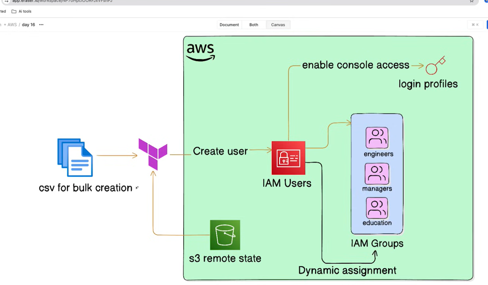

# Day 16 — Bulk IAM User Management from CSV

Provision AWS **IAM users, groups, and login credentials at scale** from a single CSV file. This project demonstrates Terraform's data-transformation features (`csvdecode`, `for_each`, `for` expressions, conditional filtering) to turn a flat employee list into fully managed IAM identities — complete with auto-generated passwords stored securely in AWS Secrets Manager.



---

## What this builds

| Resource | Purpose |
| --- | --- |
| `aws_iam_user` (one per CSV row) | An IAM user named from the employee's initials, tagged with department & job title |
| `aws_iam_user_login_profile` | A console login profile with a random 16-char password, reset required on first login |
| `aws_secretsmanager_secret` + `_version` | Stores each user's `{username, password}` JSON in Secrets Manager |
| `aws_iam_group` ×3 | `education`, `engineer`, `managers` groups |
| `aws_iam_group_membership` ×3 | Assigns users to groups based on their tags |

---

## Code walkthrough

### 1. The source data — [users.csv](users.csv)

A plain CSV with a header row. Each row is one employee.

```csv
first_name,last_name,department,job_title
Michael,Scott,Education,Regional Manager
Dwight,Schrute,Sales,Assistant to the Regional Manager
Jim,Halpert,Sales,Sales Representative
Pam,Beesly,Reception,Receptionist
...
Robert,California,Corporate,CEO
...
```

There are 26 rows. The header names (`first_name`, `last_name`, `department`, `job_title`) become the **attribute keys** of each decoded object.

---

### 2. Decoding the CSV — [locals.tf](locals.tf)

```hcl
locals {
  users = csvdecode(file("users.csv"))
}
```

**How it works:**
- `file("users.csv")` reads the file's contents as a single string.
- `csvdecode(...)` parses that string into a **list of maps**, using the header row as keys. The result is:

  ```hcl
  [
    { first_name = "Michael", last_name = "Scott",   department = "Education", job_title = "Regional Manager" },
    { first_name = "Dwight",  last_name = "Schrute", department = "Sales",     job_title = "Assistant to the Regional Manager" },
    # ...one map per row
  ]
  ```
- Storing it in `local.users` lets every other file reference the same parsed data without re-reading the file.

---

### 3. Creating one user per row — [main.tf](main.tf)

```hcl
resource "aws_iam_user" "users" {
  for_each = { for user in local.users : user.first_name => user }
  name     = "${lower(substr(each.value.first_name, 0, 1))}_${lower(substr(each.value.last_name, 0, 1))}"
  path     = "/users/"
  tags = {
    "DisplayName" = "${each.value.first_name} ${each.value.last_name}"
    "Department"  = each.value.department
    "JobTitle"    = each.value.job_title
  }
}
```

**Line by line:**

- **`for_each = { for user in local.users : user.first_name => user }`**
  `for_each` needs a **map** (or set), not a list, because each instance must have a stable, addressable key. This `for` expression rebuilds the list into a map of the form `{ "Michael" => {…}, "Dwight" => {…}, … }`. Now Terraform tracks each user under `aws_iam_user.users["Michael"]`, etc.

- **`name = "${lower(substr(each.value.first_name, 0, 1))}_${lower(substr(each.value.last_name, 0, 1))}"`**
  Builds the username from initials:
  - `substr(string, 0, 1)` takes the first character (offset 0, length 1).
  - `lower(...)` lowercases it.
  - So "Michael Scott" → `m_s`, "Dwight Schrute" → `d_s`.

- **`tags { … }`** — stores the display name, department, and job title **as tags on the IAM user**. This is the key trick: the tags are later read back to decide group membership.

> ⚠️ **Gotcha:** Keying on `first_name` assumes first names are unique. Two "Jim"s would collide and Terraform would error (duplicate map key) or silently keep only one. A composite key like `"${user.first_name}_${user.last_name}"` is safer.

---

### 4. Generating console passwords — [main.tf](main.tf)

```hcl
resource "aws_iam_user_login_profile" "users" {
  for_each                = aws_iam_user.users
  user                    = each.value.name
  password_length         = 16
  password_reset_required = true
  lifecycle {
    ignore_changes = [password_reset_required, password_length]
  }
}
```

**How it works:**
- **`for_each = aws_iam_user.users`** — iterate directly over the user resource map created above. One login profile per user, sharing the same keys.
- **`user = each.value.name`** — attaches the profile to that user's IAM name.
- **`password_length = 16`** — AWS generates a random 16-character password.
- **`password_reset_required = true`** — forces the user to change it at first login.
- **`lifecycle { ignore_changes = [...] }`** — once a user logs in and resets their password, AWS flips `password_reset_required` to `false`. Without `ignore_changes`, the next `terraform apply` would see drift and try to reset it back to `true` (regenerating the password). Ignoring these attributes prevents that churn.

---

### 5. Storing passwords in Secrets Manager — [main.tf](main.tf)

```hcl
resource "aws_secretsmanager_secret" "user_password" {
  for_each = aws_iam_user.users
  name     = "${each.value.name}_password"
}

resource "aws_secretsmanager_secret_version" "user_password" {
  for_each      = aws_iam_user.users
  secret_id     = aws_secretsmanager_secret.user_password[each.key].id
  secret_string = jsonencode({
    username = each.value.name,
    password = aws_iam_user_login_profile.users[each.key].password
  })
}
```

**How it works:**
- The first resource creates **one empty secret container** per user, named `m_s_password`, `d_s_password`, etc.
- The second resource writes the actual **secret value (a version)**:
  - `secret_id = aws_secretsmanager_secret.user_password[each.key].id` — links the version to its container using the same `each.key`.
  - `jsonencode({ username = …, password = … })` — serializes the credentials into a JSON string like `{"username":"m_s","password":"…"}`.
  - The password is pulled from `aws_iam_user_login_profile.users[each.key].password` — the value AWS generated in the previous step.

**Why bother?** IAM login-profile passwords are sensitive and shouldn't be exposed in plaintext outputs. Persisting them to Secrets Manager lets an admin retrieve a specific user's password securely and on demand, and rotate/audit it later.

---

### 6. Assigning groups by tag — [groups.tf](groups.tf)

First, three groups are declared:

```hcl
resource "aws_iam_group" "education" {
  name = "education"
  path = "/groups/"
}
resource "aws_iam_group" "engineer" {
  name = "engineer"
  path = "/groups/"
}
resource "aws_iam_group" "managers" {
  name = "managers"
  path = "/groups/"
}
```

Then membership is computed from the **tags** set on each user:

```hcl
resource "aws_iam_group_membership" "education_members" {
  name  = "education_membership"
  group = aws_iam_group.education.name
  users = [for user in aws_iam_user.users : user.name if user.tags.Department == "Education"]
}

resource "aws_iam_group_membership" "engineer_members" {
  name  = "engineer_membership"
  group = aws_iam_group.engineer.name
  users = [for user in aws_iam_user.users : user.name if user.tags.Department == "Engineering"]
}

# Managers group will have users from both management and engineering department
resource "aws_iam_group_membership" "managers_members" {
  name  = "managers_membership"
  group = aws_iam_group.managers.name
  users = [for user in aws_iam_user.users : user.name
           if contains(keys(user.tags), "JobTitle") && can(regex("Manager|CEO", user.tags.JobTitle))]
}
```

**How the filtering works:**

- **`[for user in aws_iam_user.users : user.name if <condition>]`**
  This is a **filtered list comprehension**. It iterates every created user, and only emits `user.name` for those matching the `if` condition. The result is a list of usernames passed to `users = …`.

- **Education / Engineer groups** — simple equality on the `Department` tag (`user.tags.Department == "Education"`).

- **Managers group** — a compound condition:
  - `contains(keys(user.tags), "JobTitle")` — guards against users missing the `JobTitle` tag (avoids an error when accessing a non-existent key).
  - `can(regex("Manager|CEO", user.tags.JobTitle))` — `regex(...)` matches the title against the pattern "Manager" OR "CEO"; wrapping it in `can(...)` converts any match failure into `false` instead of an error.
  - Combined with `&&`, only users that *have* a JobTitle *and* whose title contains "Manager" or "CEO" join the managers group (e.g. Michael Scott — "Regional Manager", Robert California — "CEO").

> Note: `aws_iam_group_membership` is **authoritative** — it manages the *complete* membership list for the group. Users not in the list are removed from the group.

---

### 7. Outputs — [outputs.tf](outputs.tf)

```hcl
output "account_id" {
  value = data.aws_caller_identity.name
}
output "usernames" {
  value = [for user in local.users : "${user.first_name} ${user.last_name}"]
}
output "password" {
  value     = {for user, profile in aws_iam_user_login_profile.users : user => "Password created"}
  sensitive = true
}
output "secrets" {
  value = {for user, secret in aws_secretsmanager_secret.user_password : user => secret.arn}
}
```

- **`account_id`** — the full caller-identity object from the data source below.
- **`usernames`** — a list of full display names, built with a `for` expression over `local.users`.
- **`password`** — a map of `user => "Password created"`. It deliberately does **not** print the real password; it's still marked `sensitive` as a safeguard.
- **`secrets`** — a map of `user => secret ARN`, so you know exactly which Secrets Manager entry holds each password.

---

### 8. Supporting files

**[data.tf](data.tf)** — looks up who is running Terraform:

```hcl
data "aws_caller_identity" "name" {}
```
Returns the account ID, ARN, and user ID of the credentials in use (consumed by the `account_id` output).

**[providers.tf](providers.tf)** — pins the AWS provider and defines two regional aliases:

```hcl
terraform {
  required_providers {
    aws = {
      source  = "hashicorp/aws"
      version = "~> 6.0"
    }
  }
}
provider "aws" {
  region = var.primary_reg
  alias  = "primary"
}
provider "aws" {
  alias  = "secondary"
  region = "us-east-1"
}
```
The `~> 6.0` constraint allows any 6.x version. IAM is global, so the region mostly matters for Secrets Manager; the aliases are carried over from the course's multi-region examples.

**[backend.tf](backend.tf)** — stores state remotely in S3 with locking:

```hcl
terraform {
  backend "s3" {
    bucket       = "my-tf-state-bucket-123456543210"
    key          = "dev/terraform.tfstate"
    region       = "ap-south-1"
    encrypt      = true
    use_lockfile = true
  }
}
```
- `encrypt = true` — server-side encrypts the state file.
- `use_lockfile = true` — uses S3-native state locking (no separate DynamoDB table needed) to prevent concurrent applies.

**[variables.tf](variables.tf)** — a broad catalog of variables (regions, CIDRs, instance types, plus `object`/`tuple`/`set`/`map` type examples) reused across the course. Only a subset (`primary_reg` for the provider) is consumed by this day's resources; the rest serve as reference examples of Terraform's type system.

---

## Outputs reference

| Output | Description |
| --- | --- |
| `account_id` | Current AWS account identity (from `aws_caller_identity`) |
| `usernames` | Full display names of all users |
| `password` | Map of user → "Password created" (marked `sensitive`) |
| `secrets` | Map of user → Secrets Manager secret ARN |

Retrieve a user's actual password after apply:

```bash
aws secretsmanager get-secret-value --secret-id m_s_password --query SecretString --output text
# {"username":"m_s","password":"…"}
```

---

## Terraform concepts demonstrated

- **`csvdecode` + `file`** — load external data into Terraform
- **`for_each` over a map** — create N resources from a collection
- **`for` expressions with `if`** — filter/transform collections
- **`substr`, `lower`, `regex`, `can`, `contains`** — built-in functions
- **`jsonencode`** — build structured secret payloads
- **`lifecycle { ignore_changes }`** — prevent drift on auto-generated attributes
- **Secrets Manager integration** — secure password handling
- **Authoritative group membership** — `aws_iam_group_membership`

---

## Files

| File | Purpose |
| --- | --- |
| [main.tf](main.tf) | IAM users, login profiles, Secrets Manager secrets |
| [groups.tf](groups.tf) | IAM groups & tag-based memberships |
| [locals.tf](locals.tf) | `csvdecode` of the user list |
| [users.csv](users.csv) | Source employee data (26 users) |
| [data.tf](data.tf) | `aws_caller_identity` data source |
| [outputs.tf](outputs.tf) | Account ID, usernames, secret ARNs |
| [variables.tf](variables.tf) | Variable catalog (regions, CIDRs, instance settings, etc.) |
| [providers.tf](providers.tf) | AWS provider (primary + secondary region aliases) |
| [backend.tf](backend.tf) | S3 remote state backend |

---

## Usage

```bash
# 1. Configure the S3 backend bucket in backend.tf (must already exist)
terraform init

# 2. Review the plan — 26 users + profiles + secrets + groups
terraform plan

# 3. Apply
terraform apply

# 4. Retrieve a password
aws secretsmanager get-secret-value --secret-id <username>_password \
  --query SecretString --output text

# 5. Tear down
terraform destroy
```

### Prerequisites
- Terraform ≥ 1.x, AWS provider `~> 6.0`
- AWS credentials with IAM, Secrets Manager, and STS permissions
- An existing S3 bucket for remote state (see [backend.tf](backend.tf))
