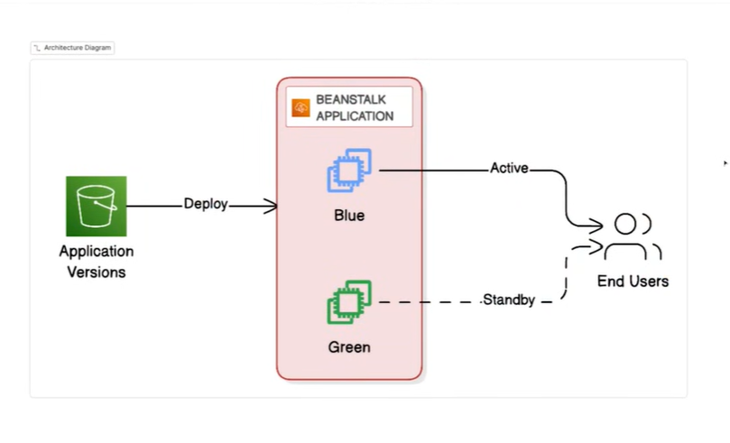

# Day 17 — Blue-Green Deployment with AWS Elastic Beanstalk

Implement a **zero-downtime Blue-Green deployment** on AWS Elastic Beanstalk using Terraform. Two identical environments run side by side — **Blue (production, v1.0)** and **Green (staging, v2.0)** — and traffic is switched between them with an instant CNAME swap. Rollback is just swapping back.



---

## The Blue-Green pattern

```text
                         ┌──────────────────────────┐
   Production traffic →  │  Blue env  (v1.0) 🔵      │  ← currently live
                         └──────────────────────────┘
                         ┌──────────────────────────┐
   Test traffic      →  │  Green env (v2.0) 🟢      │  ← validated in parallel
                         └──────────────────────────┘

   swap-environment-cnames  ⇄  flips the URLs instantly (no redeploy)
```

1. **Blue** serves production on a stable version.
2. **Green** is deployed with the new version and validated independently.
3. When Green is healthy, **swap the CNAMEs** — Green becomes production in seconds.
4. If something breaks, **swap again** to roll back instantly.

---

## Code walkthrough

### 1. Provider and shared infrastructure — [main.tf](main.tf)

#### Provider pinning

```hcl
terraform {
  required_providers {
    aws = {
      source  = "hashicorp/aws"
      version = "~> 6.0"
    }
  }
}

provider "aws" {
  region = var.aws_region
}
```

Locks to AWS provider 6.x and deploys to `var.aws_region` (default `us-east-1`).

#### IAM role for the EC2 instances

Elastic Beanstalk runs your app on EC2 instances. Those instances need an IAM role so they can talk to EB, S3, CloudWatch, etc.

```hcl
resource "aws_iam_role" "eb_ec2_role" {
  name = "${var.app_name}-eb-ec2-role"

  assume_role_policy = jsonencode({
    Version = "2012-10-17"
    Statement = [
      {
        Action    = "sts:AssumeRole"
        Effect    = "Allow"
        Principal = { Service = "ec2.amazonaws.com" }
      }
    ]
  })

  tags = var.tags
}
```

- **`assume_role_policy`** — the *trust policy*. It says "the EC2 service may assume this role." Built with `jsonencode` so the HCL object is rendered as the JSON AWS expects.

Three AWS-managed policies are attached to grant the standard EB permissions:

```hcl
resource "aws_iam_role_policy_attachment" "eb_web_tier" {
  role       = aws_iam_role.eb_ec2_role.name
  policy_arn = "arn:aws:iam::aws:policy/AWSElasticBeanstalkWebTier"
}

resource "aws_iam_role_policy_attachment" "eb_worker_tier" {
  role       = aws_iam_role.eb_ec2_role.name
  policy_arn = "arn:aws:iam::aws:policy/AWSElasticBeanstalkWorkerTier"
}

resource "aws_iam_role_policy_attachment" "eb_multicontainer_docker" {
  role       = aws_iam_role.eb_ec2_role.name
  policy_arn = "arn:aws:iam::aws:policy/AWSElasticBeanstalkMulticontainerDocker"
}
```

An **instance profile** is the wrapper that lets an EC2 instance actually use the role:

```hcl
resource "aws_iam_instance_profile" "eb_ec2_profile" {
  name = "${var.app_name}-eb-ec2-profile"
  role = aws_iam_role.eb_ec2_role.name
  tags = var.tags
}
```

#### IAM service role for Elastic Beanstalk itself

EB (the service) needs its own role to monitor environment health and perform managed updates:

```hcl
resource "aws_iam_role" "eb_service_role" {
  name = "${var.app_name}-eb-service-role"
  assume_role_policy = jsonencode({
    Version = "2012-10-17"
    Statement = [
      {
        Action    = "sts:AssumeRole"
        Effect    = "Allow"
        Principal = { Service = "elasticbeanstalk.amazonaws.com" }   # ← EB service, not EC2
      }
    ]
  })
  tags = var.tags
}

resource "aws_iam_role_policy_attachment" "eb_service_health" {
  role       = aws_iam_role.eb_service_role.name
  policy_arn = "arn:aws:iam::aws:policy/service-role/AWSElasticBeanstalkEnhancedHealth"
}

resource "aws_iam_role_policy_attachment" "eb_service_managed_updates" {
  role       = aws_iam_role.eb_service_role.name
  policy_arn = "arn:aws:iam::aws:policy/AWSElasticBeanstalkManagedUpdatesCustomerRolePolicy"
}
```

#### The EB application and the version bucket

```hcl
resource "aws_elastic_beanstalk_application" "app" {
  name        = var.app_name
  description = "Blue-Green Deployment Demo Application"
  tags        = var.tags
}

resource "aws_s3_bucket" "app_versions" {
  bucket = "${var.app_name}-versions-${data.aws_caller_identity.current.account_id}"
  tags   = var.tags
}

resource "aws_s3_bucket_public_access_block" "app_versions" {
  bucket                  = aws_s3_bucket.app_versions.id
  block_public_acls       = true
  block_public_policy     = true
  ignore_public_acls      = true
  restrict_public_buckets = true
}

data "aws_caller_identity" "current" {}
```

- The **application** is the logical container that owns versions and environments.
- The **S3 bucket** holds the zipped app bundles. Appending `data.aws_caller_identity.current.account_id` keeps the bucket name globally unique.
- The **public access block** ensures the deployment artifacts can never be exposed publicly.

---

### 2. The Blue environment — [blue-enviornment.tf](blue-enviornment.tf)

#### Upload the v1 bundle and register the version

```hcl
resource "aws_s3_object" "app_v1" {
  bucket = aws_s3_bucket.app_bucket.id
  key    = "app_v1.zip"
  source = "${path.module}/app-v1/app_v1.zip"
  etag   = filemd5("${path.module}/app-v1/app_v1.zip")
  tags   = var.tags
}

resource "elastic_beanstalk_application_version" "v1" {
  name        = "${var.app_name}-v1"
  application = aws_elastic_beanstalk_application.app.name
  description = "Version 1 of the application"
  bucket      = aws_s3_bucket.app_versions.id
  key         = aws_s3_object.app_v1.key
  tags        = var.tags
}
```

- **`source` + `etag = filemd5(...)`** — uploads the local zip and computes its MD5. When the zip changes, the etag changes, so Terraform re-uploads and EB sees a new artifact.
- **`aws_elastic_beanstalk_application_version`** — registers that S3 object as a named, deployable version of the application.

> ⚠️ **Bug to fix before apply:** this file references `aws_s3_bucket.app_bucket` (which doesn't exist — the bucket is `aws_s3_bucket.app_versions`) and uses `elastic_beanstalk_application_version` instead of `aws_elastic_beanstalk_application_version`. See the green environment file for the correct form.

#### The environment itself

```hcl
resource "aws_elastic_beanstalk_environment" "blue" {
  name                = "${var.app_name}-blue"
  application         = aws_elastic_beanstalk_application.app.name
  version_label       = elastic_beanstalk_application_version.v1.name
  solution_stack_name = var.solution_stack_name
  tier                = "WebServer"
  # ... settings ...
}
```

Everything else about an EB environment is configured through repeated **`setting` blocks**. Each block targets a `namespace` (the config category) and a `name` (the key). The important ones:

```hcl
# Attach the EC2 instance profile created in main.tf
setting {
  namespace = "aws:autoscaling:launchconfiguration"
  name      = "IamInstanceProfile"
  value     = aws_iam_instance_profile.eb_ec2_profile.name
}

# Attach the EB service role
setting {
  namespace = "aws:elasticbeanstalk:environment"
  name      = "ServiceRole"
  value     = aws_iam_role.eb_service_role.name
}

# Instance size
setting {
  namespace = "aws:autoscaling:launchconfiguration"
  name      = "InstanceType"
  value     = var.instance_type
}

# Run behind an Application Load Balancer
setting {
  namespace = "aws:elasticbeanstalk:environment"
  name      = "EnvironmentType"
  value     = "LoadBalanced"
}
setting {
  namespace = "aws:elasticbeanstalk:environment"
  name      = "LoadBalancerType"
  value     = "application"
}

# Auto Scaling group: 1–2 instances
setting {
  namespace = "aws:autoscaling:asg"
  name      = "MinSize"
  value     = "1"
}
setting {
  namespace = "aws:autoscaling:asg"
  name      = "MaxSize"
  value     = "2"
}

# Enhanced health reporting
setting {
  namespace = "aws:elasticbeanstalk:healthreporting:system"
  name      = "SystemType"
  value     = "enhanced"
}

# Health check + the port the Node app listens on
setting {
  namespace = "aws:elasticbeanstalk:environment:process:default"
  name      = "HealthCheckPath"
  value     = "/"
}
setting {
  namespace = "aws:elasticbeanstalk:environment:process:default"
  name      = "Port"
  value     = "8080"
}

# Environment variables injected into the app
setting {
  namespace = "aws:elasticbeanstalk:application:environment"
  name      = "ENVIRONMENT"
  value     = "blue"
}
setting {
  namespace = "aws:elasticbeanstalk:application:environment"
  name      = "VERSION"
  value     = "1.0"
}

# Rolling deployment, 50% at a time
setting {
  namespace = "aws:elasticbeanstalk:command"
  name      = "DeploymentPolicy"
  value     = "Rolling"
}
setting {
  namespace = "aws:elasticbeanstalk:command"
  name      = "BatchSizeType"
  value     = "Percentage"
}
setting {
  namespace = "aws:elasticbeanstalk:command"
  name      = "BatchSize"
  value     = "50"
}
```

Finally the tags identify this as production:

```hcl
tags = merge(
  var.tags,
  {
    Environment = "blue"
    Role        = "production"
  }
)
```

`merge()` combines the common `var.tags` with the blue-specific tags into one map.

---

### 3. The Green environment — [green-enviornment.tf](green-enviornment.tf)

Structurally identical to Blue, but points at **v2** and is tagged as staging. The corrected resource names here are the reference for fixing the Blue file:

```hcl
resource "aws_s3_object" "app_v2" {
  bucket = aws_s3_bucket.app_versions.id        # correct bucket reference
  key    = "app-v2.zip"
  source = "${path.module}/app-v2/app-v2.zip"
  etag   = filemd5("${path.module}/app-v2/app-v2.zip")
  tags   = var.tags
}

resource "aws_elastic_beanstalk_application_version" "v2" {   # correct: aws_ prefix
  name        = "${var.app_name}-v2"
  application = aws_elastic_beanstalk_application.app.name
  description = "Application Version 2.0 - New Feature Release"
  bucket      = aws_s3_bucket.app_versions.id
  key         = aws_s3_object.app_v2.id
  tags        = var.tags
}

resource "aws_elastic_beanstalk_environment" "green" {
  name                = "${var.app_name}-green"
  application         = aws_elastic_beanstalk_application.app.name
  solution_stack_name = var.solution_stack_name
  tier                = "WebServer"
  version_label       = aws_elastic_beanstalk_application_version.v2.name
  # ... identical setting blocks, except: ...
}
```

The only behavioral differences in the settings are the env vars and tags:

```hcl
setting {
  namespace = "aws:elasticbeanstalk:application:environment"
  name      = "ENVIRONMENT"
  value     = "green"
}
setting {
  namespace = "aws:elasticbeanstalk:application:environment"
  name      = "VERSION"
  value     = "2.0"
}

tags = merge(var.tags, {
  Environment = "green"
  Role        = "staging"
})
```

---

### 4. The applications — [app-v1/](app-v1/) and [app-v2/](app-v2/)

Both are small Express servers. The key parts of [app-v1/app.js](app-v1/app.js):

```javascript
const express = require('express');
const app = express();
const PORT = process.env.PORT || 8080;   // EB injects PORT; falls back to 8080

// Request logging middleware
app.use((req, res, next) => {
  console.log(`${new Date().toISOString()} - ${req.method} ${req.url}`);
  next();
});

// Health check — this is what EB's HealthCheckPath ("/") and load balancer probe
app.get('/health', (req, res) => {
  res.status(200).json({ status: 'healthy', version: '1.0', environment: 'blue', timestamp: new Date().toISOString() });
});

// Landing page — blue gradient, "Version 1.0 / PRODUCTION"
app.get('/', (req, res) => { res.send(`<!DOCTYPE html> ... blue themed page ... `); });

// JSON info endpoint
app.get('/api/info', (req, res) => {
  res.json({ version: '1.0', environment: 'blue', status: 'production', hostname: require('os').hostname(), ... });
});

app.listen(PORT, () => console.log(`✅ Application v1.0 (Blue) running on port ${PORT}`));

// Graceful shutdown so EB rolling deploys don't drop in-flight requests
process.on('SIGTERM', () => { console.log('SIGTERM received'); process.exit(0); });
```

[app-v2/app.js](app-v2/app.js) is the same shape but **green-themed**, reports `version: '2.0'` / `environment: 'green'`, lists "what's new" features on the page, and adds a brand-new endpoint:

```javascript
// Only present in v2.0 — proves the new version is live after a swap
app.get('/api/features', (req, res) => {
  res.json({
    version: '2.0',
    newFeatures: [
      { name: 'Modern UI',        description: 'Complete redesign', status: 'completed' },
      { name: 'Performance Boost', description: '50% faster load times', status: 'completed' },
      { name: 'Advanced Analytics', description: 'Real-time insights', status: 'completed' }
    ]
  });
});
```

Each app declares Express as its only dependency ([app-v1/package.json](app-v1/package.json), [app-v2/package.json](app-v2/package.json)):

```json
{
  "name": "bluegreen-demo-v1",
  "version": "1.0.0",
  "main": "app.js",
  "scripts": { "start": "node app.js" },
  "dependencies": { "express": "^4.18.2" },
  "engines": { "node": ">=18.x" }
}
```

---

### 5. Packaging the apps — [package-apps.sh](package-apps.sh)

```bash
#!/bin/bash
# Package Version 1.0 (Blue)
cd app-v1
[ -f "app-v1.zip" ] && rm -f app-v1.zip      # remove any stale zip
zip -q app-v1.zip app.js package.json        # bundle the two files EB needs
cd ..

# Package Version 2.0 (Green)
cd app-v2
[ -f "app-v2.zip" ] && rm -f app-v2.zip
zip -q app-v2.zip app.js package.json
cd ..
```

It simply zips `app.js` + `package.json` for each version. EB installs dependencies from `package.json` on the instance, so `node_modules` is not bundled. Terraform's `filemd5(...)` on these zips drives re-uploads when the code changes.

---

### 6. Swapping environments — [swap-environments.sh](swap-environments.sh)

The core of the script — everything else is argument parsing, dependency checks, and confirmation prompts:

```bash
# If env names weren't passed in, read them from Terraform outputs
TF_OUTPUT=$(terraform output -json 2>&1)
BLUE_ENV=$(echo "$TF_OUTPUT" | jq -r '.blue_environment_name.value')
GREEN_ENV=$(echo "$TF_OUTPUT" | jq -r '.green_environment_name.value')

# Perform the actual swap — this is the zero-downtime cutover
aws elasticbeanstalk swap-environment-cnames \
  --source-environment-name "$BLUE_ENV" \
  --destination-environment-name "$GREEN_ENV" \
  --region "$REGION"
```

**How the swap works:** each EB environment has a CNAME (e.g. `my-app-bluegreen-blue.<region>.elasticbeanstalk.com`). `swap-environment-cnames` exchanges the two CNAMEs at the DNS level. The instances don't restart and no code is redeployed — traffic just starts flowing to the other environment within ~1–2 minutes. Running the same command again swaps them back (instant rollback).

The script also:
- Parses `--region`, `--blue`, `--green` flags.
- Verifies `terraform`, `jq`, and `aws` are installed before running.
- Prints a warning and waits for a keypress before swapping production traffic.

---

### 7. Outputs — [output.tf](output.tf)

```hcl
output "application_name"      { value = aws_elastic_beanstalk_application.app.name }
output "blue_environment_name" { value = aws_elastic_beanstalk_environment.blue.name }
output "blue_environment_url"  { value = "http://${aws_elastic_beanstalk_environment.blue.cname}" }
output "green_environment_name"{ value = aws_elastic_beanstalk_environment.green.name }
output "green_environment_url" { value = "http://${aws_elastic_beanstalk_environment.green.cname}" }
output "s3_bucket"             { value = aws_s3_bucket.app_versions.id }
```

Two outputs use **heredoc (`<<-EOT`)** strings to emit ready-to-use guidance. `swap_command` prints the exact AWS CLI command (with the real env names interpolated), and `instructions` prints a full numbered walkthrough:

```hcl
output "swap_command" {
  value = <<-EOT
    aws elasticbeanstalk swap-environment-cnames \
      --source-environment-name ${aws_elastic_beanstalk_environment.blue.name} \
      --destination-environment-name ${aws_elastic_beanstalk_environment.green.name} \
      --region ${var.aws_region}
  EOT
}
```

The `<<-` form lets the closing `EOT` be indented and strips the leading indentation from the body.

---

### 8. Variables — [variable.tf](variable.tf)

```hcl
variable "aws_region"          { type = string; default = "us-east-1" }
variable "app_name"            { type = string; default = "my-app-bluegreen" }
variable "solution_stack_name" {
  type    = string
  default = "64bit Amazon Linux 2023 v6.6.8 running Node.js 20"   # the EB platform
}
variable "instance_type" { type = string; default = "t3.micro" }
variable "tags" {
  type = map(string)
  default = {
    Project     = "BlueGreenDeployment"
    Environment = "Demo"
    ManagedBy   = "Terraform"
  }
}
```

`solution_stack_name` is the most important one — it selects the managed platform (Node.js 20 on Amazon Linux 2023). It must be a **currently valid** stack name; AWS retires old ones, so verify with `aws elasticbeanstalk list-available-solution-stacks` if apply fails.

**[backend.tf](backend.tf)** stores state in S3 with `encrypt = true` and `use_lockfile = true` (S3-native locking).

---

## End-to-end workflow

```bash
# 1. Package both app versions into zips
./package-apps.sh

# 2. Deploy both environments
terraform init
terraform plan
terraform apply        # prints the `instructions` output with live URLs

# 3. Verify
#    Blue URL  → "Welcome to Version 1.0 - Blue Environment"
#    Green URL → "Welcome to Version 2.0 - Green Environment"

# 4. Cut over (swap CNAMEs) — Green becomes production
./swap-environments.sh --region us-east-1

# 5. Roll back if needed — run the same swap again
./swap-environments.sh --region us-east-1

# 6. Tear down
terraform destroy
```

---

## Terraform / AWS concepts demonstrated

- **Elastic Beanstalk** applications, application versions, and environments
- **EB `setting` blocks** — configuring namespaces for IAM, autoscaling, health, deployment policy, env vars
- **IAM roles & instance profiles** for managed compute (EC2 role vs. service role)
- **`filemd5` + `aws_s3_object`** — change detection on deployment artifacts
- **`merge()`** for composing tags
- **Heredoc (`<<-EOT`) outputs** — emitting multi-line instructions
- **Blue-Green deployment** as infrastructure, with CNAME swap as the cutover

---

## Files

| File | Purpose |
| --- | --- |
| [main.tf](main.tf) | Provider, IAM roles, EB application, S3 versions bucket |
| [blue-enviornment.tf](blue-enviornment.tf) | Blue (v1.0, production) environment |
| [green-enviornment.tf](green-enviornment.tf) | Green (v2.0, staging) environment |
| [output.tf](output.tf) | URLs, CNAMEs, swap command, instructions |
| [variable.tf](variable.tf) | App name, region, platform, instance type, tags |
| [backend.tf](backend.tf) | S3 remote state backend |
| [package-apps.sh](package-apps.sh) | Zips both app versions |
| [swap-environments.sh](swap-environments.sh) | Performs / scripts the CNAME swap |
| [app-v1/](app-v1/) | Node.js app, Version 1.0 (Blue) |
| [app-v2/](app-v2/) | Node.js app, Version 2.0 (Green) |

---

## Known issues / gotchas

- **[blue-enviornment.tf](blue-enviornment.tf)** uses `elastic_beanstalk_application_version` (missing the `aws_` prefix) and references `aws_s3_bucket.app_bucket` — fix these to `aws_elastic_beanstalk_application_version` and `aws_s3_bucket.app_versions` (see the green file for the correct form) before `apply`.
- The Blue env file declares duplicate IAM `setting` blocks (harmless but redundant).
- `swap-environments.sh` requires the **AWS CLI**, **Terraform**, and **`jq`** on PATH.
- Verify `solution_stack_name` is still a valid platform in your region.

### Prerequisites
- Terraform ≥ 1.x, AWS provider `~> 6.0`
- Node.js (for local testing of the apps), `zip`, `jq`, AWS CLI
- An existing S3 bucket for remote state (see [backend.tf](backend.tf))
