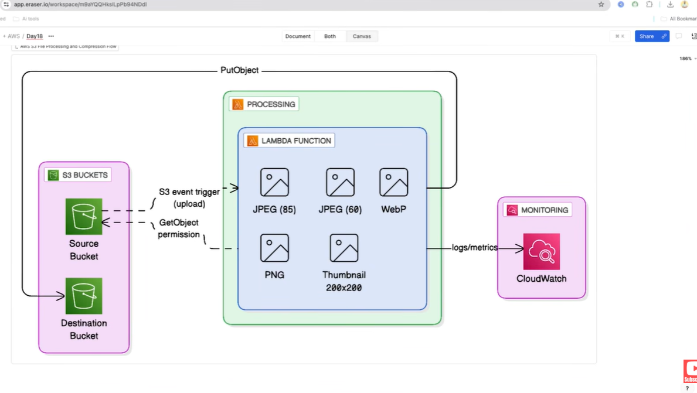

# Day 18 — Serverless Image Processing Pipeline (S3 + Lambda)

A fully serverless, event-driven **image processing pipeline** built with Terraform. Upload an image to one S3 bucket and an AWS Lambda function automatically compresses it, converts it to multiple formats, and generates a thumbnail — saving every variant to a second bucket. Image processing uses the **Pillow** library, packaged as a **Lambda Layer** built with Docker for Linux compatibility.



---

## Architecture

```text
   ┌────────────┐   s3:ObjectCreated:*   ┌─────────────────────┐   put variants   ┌────────────────┐
   │  Upload    │ ─────────────────────▶ │  Lambda             │ ───────────────▶ │  Processed     │
   │  S3 bucket │     (event trigger)    │  image_processor    │                  │  S3 bucket     │
   └────────────┘                        │  + Pillow Layer     │                  └────────────────┘
                                         └─────────┬───────────┘
                                                   │ logs
                                                   ▼
                                         ┌─────────────────────┐
                                         │  CloudWatch Logs     │
                                         │  (7-day retention)   │
                                         └─────────────────────┘
```

**Flow:** Upload image → S3 fires `ObjectCreated` event → Lambda is invoked → Pillow processes the image → 5 variants written to the processed bucket → logs to CloudWatch.

---

## Code walkthrough

### 1. Providers — [provider.tf](provider.tf)

```hcl
terraform {
  required_providers {
    aws    = { source = "hashicorp/aws",     version = "~> 6.0" }
    archive = { source = "hashicorp/archive", version = "~> 2.4" }   # zips the Lambda code
    random = { source = "hashicorp/random",   version = "~> 3.6" }   # unique name suffixes
  }
}

provider "aws" {
  region = var.aws_region
  default_tags {
    tags = {
      Project     = "ImageProcessingApp"
      Environment = var.environment
      ManagedBy   = "Terraform"
    }
  }
}
```

- Three providers are needed: **aws**, **archive** (to zip the function source in-pipeline), and **random** (for unique bucket names).
- **`default_tags`** automatically applies `Project`/`Environment`/`ManagedBy` to *every* resource the AWS provider creates — no need to repeat `tags = …` on each resource.

---

### 2. Computed names — [locals.tf](locals.tf)

```hcl
locals {
  bucket_prefix         = "${var.project_name}-${var.environment}"
  upload_bucket_name    = "${local.bucket_prefix}-upload-${random_id.suffix.hex}"
  processed_bucket_name = "${local.bucket_prefix}-processed-${random_id.suffix.hex}"
  lambda_function_name  = "${var.project_name}-${var.environment}-processor"
}
```

S3 bucket names must be **globally unique**. By interpolating `random_id.suffix.hex` (a random 8-hex-char string), the buckets become e.g. `image-processor-dev-upload-a1b2c3d4`. Centralizing these in `locals` keeps naming consistent across the config.

---

### 3. The buckets and their hardening — [main.tf](main.tf)

```hcl
resource "random_id" "suffix" {
  byte_length = 4          # 4 bytes → 8 hex characters
}

resource "aws_s3_bucket" "upload_bucket" {
  bucket = local.upload_bucket_name
}
resource "aws_s3_bucket" "processed_bucket" {
  bucket = local.processed_bucket_name
}
```

Each bucket gets three protective configurations:

```hcl
# Versioning — keep history of every object (also why destroy.sh must purge versions)
resource "aws_s3_bucket_versioning" "upload_bucket" {
  bucket = aws_s3_bucket.upload_bucket.id
  versioning_configuration { status = "Enabled" }
}

# Server-side encryption at rest (AES256)
resource "aws_s3_bucket_server_side_encryption_configuration" "upload_bucket" {
  bucket = aws_s3_bucket.upload_bucket.id
  rule {
    apply_server_side_encryption_by_default { sse_algorithm = "AES256" }
  }
}

# Block ALL public access
resource "aws_s3_bucket_public_access_block" "upload_bucket" {
  bucket                  = aws_s3_bucket.upload_bucket.id
  block_public_acls       = true
  block_public_policy     = true
  ignore_public_acls      = true
  restrict_public_buckets = true
}
```

The same three resources are declared for `processed_bucket`. This is the standard "secure S3 bucket" baseline: **versioned, encrypted, private**.

---

### 4. Least-privilege IAM for the Lambda — [main.tf](main.tf)

The execution role's trust policy lets the Lambda service assume it:

```hcl
resource "aws_iam_role" "lambda_role" {
  name = "${var.project_name}-${var.environment}-lambda-role"
  assume_role_policy = jsonencode({
    Version = "2012-10-17"
    Statement = [{
      Action    = "sts:AssumeRole"
      Effect    = "Allow"
      Principal = { Service = "lambda.amazonaws.com" }
    }]
  })
}
```

The inline policy grants exactly what the function needs — nothing more:

```hcl
resource "aws_iam_role_policy" "lambda_policy" {
  name = "${var.project_name}-${var.environment}-lambda-policy"
  role = aws_iam_role.lambda_role.id
  policy = jsonencode({
    Version = "2012-10-17"
    Statement = [
      {
        Effect   = "Allow"
        Action   = ["logs:CreateLogGroup", "logs:CreateLogStream", "logs:PutLogEvents"]
        Resource = "arn:aws:logs:${var.aws_region}:*:*"        # write CloudWatch logs
      },
      {
        Effect   = "Allow"
        Action   = ["s3:GetObject", "s3:GetObjectVersion"]
        Resource = "${aws_s3_bucket.upload_bucket.arn}/*"      # READ from upload bucket only
      },
      {
        Effect   = "Allow"
        Action   = ["s3:PutObject", "s3:PutObjectAcl"]
        Resource = "${aws_s3_bucket.processed_bucket.arn}/*"   # WRITE to processed bucket only
      }
    ]
  })
}
```

Note the asymmetry: the Lambda can only **read** the upload bucket and only **write** the processed bucket. It cannot, for example, write back to the upload bucket — which also prevents infinite trigger loops.

---

### 5. The Pillow layer — [main.tf](main.tf)

```hcl
resource "aws_lambda_layer_version" "pillow_layer" {
  filename            = "${path.module}/pillow_layer.zip"
  layer_name          = "${var.project_name}-pillow-layer"
  compatible_runtimes = ["python3.12"]
  description         = "Lambda layer containing Pillow library for image processing"
}
```

A **Lambda Layer** packages dependencies separately from your function code so they can be shared and kept out of the deployment zip. `filename` points to `pillow_layer.zip`, which you must build first (see step 9).

---

### 6. Zipping and defining the function — [main.tf](main.tf)

```hcl
data "archive_file" "lambda_zip" {
  type        = "zip"
  source_file = "${path.module}/lambda/lambda_function.py"
  output_path = "${path.module}/lambda_function.zip"
}

resource "aws_lambda_function" "image_processor" {
  function_name    = local.lambda_function_name
  role             = aws_iam_role.lambda_role.arn
  handler          = "lambda_function.lambda_handler"      # file.function
  runtime          = "python3.12"
  timeout          = var.lambda_timeout                    # 60s
  memory_size      = var.lambda_memory_size                # 1024 MB
  filename         = data.archive_file.lambda_zip.output_path
  source_code_hash = data.archive_file.lambda_zip.output_base64sha256
  layers           = [aws_lambda_layer_version.pillow_layer.arn]

  environment {
    variables = {
      PROCESSED_BUCKET = aws_s3_bucket.processed_bucket.id
      LOG_LEVEL        = "INFO"
    }
  }
}
```

**Key fields:**
- **`data "archive_file"`** — zips `lambda_function.py` at plan time into `lambda_function.zip`. No manual zipping needed for the function code (only the layer needs Docker).
- **`handler = "lambda_function.lambda_handler"`** — `<filename without .py>.<function name>`.
- **`source_code_hash`** — set to the zip's base64 SHA256. When the source changes, the hash changes, and Terraform redeploys the function. Without it, code-only edits might not be detected.
- **`layers`** — attaches the Pillow layer so `import PIL` works at runtime.
- **`environment.variables`** — `PROCESSED_BUCKET` tells the function where to write; `LOG_LEVEL` controls logging verbosity. The Python code reads both via `os.environ`.

---

### 7. Logging and the S3 trigger — [main.tf](main.tf)

```hcl
# Explicit log group so we control retention (otherwise Lambda auto-creates one, never expiring)
resource "aws_cloudwatch_log_group" "lambda_log_group" {
  name              = "/aws/lambda/${aws_lambda_function.image_processor.function_name}"
  retention_in_days = 7
}

# Allow the S3 service to invoke this specific function
resource "aws_lambda_permission" "s3_invoke" {
  statement_id  = "AllowExecutionFromS3"
  action        = "lambda:InvokeFunction"
  function_name = aws_lambda_function.image_processor.function_name
  principal     = "s3.amazonaws.com"
  source_arn    = aws_s3_bucket.upload_bucket.arn
}

# Wire upload-bucket "object created" events to the Lambda
resource "aws_s3_bucket_notification" "upload_bucket_notification" {
  bucket = aws_s3_bucket.upload_bucket.id
  lambda_function {
    lambda_function_arn = aws_lambda_function.image_processor.arn
    events              = ["s3:ObjectCreated:*"]   # any create: PUT, POST, copy, multipart
    filter_prefix       = ""                        # all keys
    filter_suffix       = ""                        # all extensions
  }
  depends_on = [aws_lambda_permission.s3_invoke]    # permission must exist before the notification
}
```

**How the trigger works:**
1. The **permission** is the prerequisite — S3 cannot invoke a Lambda unless the function grants `lambda:InvokeFunction` to the `s3.amazonaws.com` principal for that source bucket.
2. The **bucket notification** then says: on any `s3:ObjectCreated:*` event in the upload bucket, invoke the function.
3. **`depends_on`** forces Terraform to create the permission *before* the notification — otherwise AWS rejects the notification with a permissions error.

---

### 8. The image-processing handler — [lambda/lambda_function.py](lambda/lambda_function.py)

#### Setup

```python
import json, boto3, os, logging, uuid
from urllib.parse import unquote_plus
from io import BytesIO
from PIL import Image          # provided by the Pillow layer

logger = logging.getLogger()
logger.setLevel(os.environ.get('LOG_LEVEL', 'INFO'))
s3_client = boto3.client('s3')

DEFAULT_QUALITY = 85
MAX_DIMENSION   = 4096
```

#### The entry point

```python
def lambda_handler(event, context):
    try:
        for record in event['Records']:                       # S3 can batch multiple objects
            bucket = record['s3']['bucket']['name']
            key    = unquote_plus(record['s3']['object']['key'])   # decode "%20" etc. in the key

            response   = s3_client.get_object(Bucket=bucket, Key=key)
            image_data = response['Body'].read()               # download bytes

            processed_images = process_image(image_data, key)  # do the work
            processed_bucket = os.environ['PROCESSED_BUCKET']

            for processed_image in processed_images:           # upload each variant
                s3_client.put_object(
                    Bucket=processed_bucket,
                    Key=processed_image['key'],
                    Body=processed_image['data'],
                    ContentType=processed_image['content_type'],
                    Metadata={'original-key': key, 'processed-by': 'lambda-image-processor'}
                )
        return {'statusCode': 200, 'body': json.dumps({'message': 'Image processed successfully', ...})}
    except Exception as e:
        logger.error(f"Error processing image: {e}", exc_info=True)
        return {'statusCode': 500, 'body': json.dumps({'error': str(e)})}
```

- **`unquote_plus`** — S3 URL-encodes object keys in the event, so a file named `my photo.jpg` arrives as `my+photo.jpg`. This decodes it back.
- The handler reads each uploaded object, processes it, and writes every returned variant to the processed bucket, tagging each with `original-key` metadata.

#### The processing logic

```python
def process_image(image_data, original_key):
    image = Image.open(BytesIO(image_data))

    # Normalize color mode so JPEG saving works (JPEG has no alpha channel)
    if image.mode in ('RGBA', 'LA', 'P'):
        background = Image.new('RGB', image.size, (255, 255, 255))   # white background
        if image.mode == 'P':
            image = image.convert('RGBA')
        background.paste(image, mask=image.split()[-1] if image.mode in ('RGBA', 'LA') else None)
        image = background
    elif image.mode != 'RGB':
        image = image.convert('RGB')

    width, height = image.size

    # Downscale oversized images, preserving aspect ratio
    if width > MAX_DIMENSION or height > MAX_DIMENSION:
        ratio = min(MAX_DIMENSION / width, MAX_DIMENSION / height)
        image = image.resize((int(width * ratio), int(height * ratio)), Image.Resampling.LANCZOS)

    base_name = os.path.splitext(original_key)[0]
    unique_id = str(uuid.uuid4())[:8]      # avoid key collisions between runs

    # Five output variants
    variants = [
        {'format': 'JPEG', 'quality': 85,   'suffix': 'compressed'},
        {'format': 'JPEG', 'quality': 60,   'suffix': 'low'},
        {'format': 'WEBP', 'quality': 85,   'suffix': 'webp'},
        {'format': 'PNG',  'quality': None, 'suffix': 'png'}
    ]

    processed_images = []
    for variant in variants:
        output = BytesIO()
        if variant['quality']:
            image.save(output, format=variant['format'], quality=variant['quality'], optimize=True)
        else:
            image.save(output, format=variant['format'], optimize=True)
        output.seek(0)
        ext = 'jpg' if variant['format'] == 'JPEG' else variant['format'].lower()
        processed_images.append({
            'key': f"{base_name}_{variant['suffix']}_{unique_id}.{ext}",
            'data': output.getvalue(),
            'content_type': {'JPEG':'image/jpeg','PNG':'image/png','WEBP':'image/webp'}[variant['format']],
            ...
        })

    # Plus a thumbnail (max 300×300)
    thumbnail = image.copy()
    thumbnail.thumbnail((300, 300), Image.Resampling.LANCZOS)
    thumb_output = BytesIO()
    thumbnail.save(thumb_output, format='JPEG', quality=80, optimize=True)
    processed_images.append({'key': f"{base_name}_thumbnail_{unique_id}.jpg", ...})

    return processed_images
```

**What it produces per upload:**

| Variant | Format | Quality | Key suffix |
| --- | --- | --- | --- |
| Compressed | JPEG | 85 | `_compressed` |
| Low quality | JPEG | 60 | `_low` |
| WebP | WEBP | 85 | `_webp` |
| PNG | PNG | — | `_png` |
| Thumbnail | JPEG | 80 (≤300×300) | `_thumbnail` |

Key techniques: **mode normalization** (RGBA→RGB onto a white background so JPEG saves cleanly), **LANCZOS resampling** for high-quality resizes, and a **UUID suffix** so repeated processing of the same source never overwrites prior outputs.

[lambda/requirements.txt](lambda/requirements.txt) pins the dependency: `Pillow==10.4.0`.

---

### 9. Building the Pillow layer — [scripts/build_layer_docker.sh](scripts/build_layer_docker.sh)

Pillow contains **compiled native code**, so it must be built for Lambda's OS/architecture (Linux x86-64) — not your laptop. The script uses Docker to guarantee that:

```bash
docker run --rm \
  --platform linux/amd64 \                 # match Lambda's architecture
  -v "$TERRAFORM_DIR":/output \            # mount output dir into the container
  python:3.12-slim \                       # match the Lambda runtime
  bash -c "
    pip install --quiet Pillow==10.4.0 -t /tmp/python/lib/python3.12/site-packages/ && \
    cd /tmp && \
    zip -q -r pillow_layer.zip python/ && \ # layer must use the python/ directory layout
    cp pillow_layer.zip /output/
  "
```

**Why this matters:**
- `--platform linux/amd64` + `python:3.12-slim` ensure the binaries match the Lambda runtime exactly.
- Lambda layers require dependencies under a specific path (`python/lib/python3.12/site-packages/`), which is why the install target and the `zip` of `python/` are structured that way.
- The resulting `pillow_layer.zip` is what `aws_lambda_layer_version.pillow_layer` references in [main.tf](main.tf).

> ⚠️ You must run this **before** `terraform apply`, or the layer resource fails to find its `filename`.

---

### 10. Deploy and destroy scripts

**[scripts/deploy.sh](scripts/deploy.sh)** — one-shot build + deploy:

```bash
bash "$SCRIPT_DIR/build_layer_docker.sh"   # 1. build the layer
terraform init                              # 2. init
terraform plan -out=tfplan                  # 3. plan
terraform apply tfplan                      # 4. apply
# 5. print bucket/function names from `terraform output`
```

**[scripts/destroy.sh](scripts/destroy.sh)** — versioned buckets can't be deleted while they contain objects, so it empties them first:

```bash
empty_versioned_bucket() {
  local bucket=$1
  # Delete every object VERSION
  aws s3api list-object-versions --bucket "$bucket" --output json | \
    jq -r '.Versions[]? | "\(.Key) \(.VersionId)"' | \
    while read key version; do
      aws s3api delete-object --bucket "$bucket" --key "$key" --version-id "$version"
    done
  # Delete every DELETE MARKER too
  aws s3api list-object-versions --bucket "$bucket" --output json | \
    jq -r '.DeleteMarkers[]? | "\(.Key) \(.VersionId)"' | \
    while read key version; do
      aws s3api delete-object --bucket "$bucket" --key "$key" --version-id "$version"
    done
}
# ...empty upload + processed buckets, then:
terraform destroy -auto-approve
```

Because versioning is enabled, simply deleting objects leaves **delete markers** and old **versions** behind — the script removes both so `terraform destroy` can drop the buckets.

> Note: the helper scripts reference a `terraform/` subdirectory (and `deploy.sh` reads outputs like `upload_bucket_name`). In this repo the Terraform files live at the day18 root and no `outputs.tf` is present — adjust the `PROJECT_DIR/terraform` paths and add outputs if you use the scripts as-is.

---

### 11. Variables — [variables.tf](variables.tf)

```hcl
variable "aws_region"         { type = string; default = "ap-south-1" }
variable "environment"        { type = string; default = "dev" }
variable "project_name"       { type = string; default = "image-processor" }
variable "lambda_timeout"     { type = number; default = 60 }     # seconds
variable "lambda_memory_size" { type = number; default = 1024 }   # MB (more memory = more CPU)
variable "allowed_origins"    { type = list(string); default = ["*"] }   # reserved for a frontend
```

`lambda_memory_size` is worth tuning: image processing is CPU-bound, and Lambda scales CPU proportionally to memory, so 1024 MB gives a meaningful speed-up over the 128 MB default.

**[backend.tf](backend.tf)** stores state in S3 with `encrypt = true` and `use_lockfile = true`.

---

## Usage

```bash
# 1. Build the Pillow layer (requires Docker)
bash scripts/build_layer_docker.sh        # produces pillow_layer.zip

# 2. Deploy
terraform init
terraform plan
terraform apply

# 3. Trigger the pipeline — upload an image to the upload bucket
aws s3 cp my-photo.jpg s3://<upload-bucket-name>/

# 4. Inspect the results
aws s3 ls s3://<processed-bucket-name>/
#   my-photo_compressed_xxxx.jpg
#   my-photo_low_xxxx.jpg
#   my-photo_webp_xxxx.webp
#   my-photo_png_xxxx.png
#   my-photo_thumbnail_xxxx.jpg

# 5. Watch logs
aws logs tail /aws/lambda/image-processor-dev-processor --follow

# 6. Tear down (empties versioned buckets first)
bash scripts/destroy.sh
```

---

## Terraform / AWS concepts demonstrated

- **Event-driven serverless** — S3 → Lambda via `aws_s3_bucket_notification`
- **`aws_lambda_permission`** — granting S3 the right to invoke the function (+ `depends_on` ordering)
- **Lambda Layers** — sharing native dependencies (Pillow) across functions
- **`archive_file` data source** — zipping source code in-pipeline
- **`source_code_hash`** — redeploy only when code changes
- **`random_id`** for globally-unique names
- **S3 hardening** — versioning, SSE (AES256), public access block
- **Least-privilege IAM** — scoped read/write per bucket + logs
- **Provider `default_tags`** — consistent tagging
- **CloudWatch log groups** with retention

---

## Files

| File | Purpose |
| --- | --- |
| [main.tf](main.tf) | Buckets, IAM, Lambda, layer, notification, log group |
| [locals.tf](locals.tf) | Computed bucket / function names |
| [variables.tf](variables.tf) | Region, environment, Lambda sizing |
| [provider.tf](provider.tf) | AWS + archive + random providers, default tags |
| [backend.tf](backend.tf) | S3 remote state backend |
| [lambda/lambda_function.py](lambda/lambda_function.py) | Image processing handler (Pillow) |
| [lambda/requirements.txt](lambda/requirements.txt) | `Pillow==10.4.0` |
| [scripts/build_layer_docker.sh](scripts/build_layer_docker.sh) | Build Pillow layer via Docker |
| [scripts/deploy.sh](scripts/deploy.sh) | One-shot build + deploy |
| [scripts/destroy.sh](scripts/destroy.sh) | Empty buckets + destroy |

### Prerequisites
- Terraform ≥ 1.x, AWS provider `~> 6.0`
- **Docker** (to build the Pillow layer), AWS CLI, `jq` (for `destroy.sh`)
- AWS credentials with S3, Lambda, IAM, and CloudWatch permissions
- An existing S3 bucket for remote state (see [backend.tf](backend.tf))
