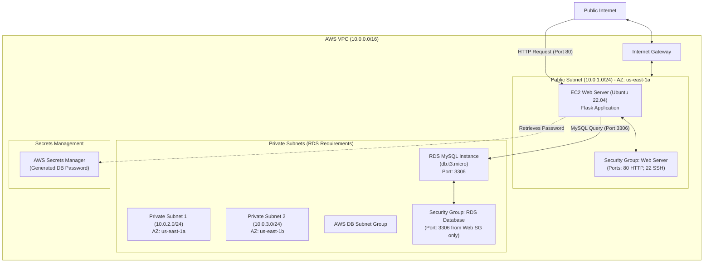

# 📝 Detailed Project Notes: Day 22 - RDS Database & Modular Terraform

This document provides a highly detailed explanation of the architecture, components, module designs, and application code in this project folder.

---

## 1. Architectural Design & Network Topology

This folder implements a highly secure, **three-tier network architecture** using AWS resources orchestrated through Terraform. The design enforces network segregation by separating the public web interface from the private database layer.

### 📌 Visual Architecture Diagram
Below is the architectural diagram of the provisioned infrastructure:



### 🔑 Security Design Principles Applied
1. **Network Isolation**: The RDS instance is placed strictly within the private subnets. These subnets do not have routes to the Internet Gateway (`IGW`), making it impossible for external traffic to reach the database directly.
2. **Least Privilege Firewalls (Security Groups)**: 
   - The web server accepts `HTTP (80)` and `SSH (22)` traffic from anywhere.
   - The RDS instance only accepts `MySQL (3306)` traffic *explicitly originating* from the security group assigned to the EC2 web server. Even other resources inside the VPC cannot connect unless they hold that exact security group.
3. **Automated Secret Rotation/Storage**: No passwords are hardcoded in Terraform variables or configuration files. The database password is dynamically generated using the Terraform `random` provider and stored securely inside **AWS Secrets Manager**.

---

## 2. Directory Structure & Organization

The repository follows a clean, modular structure, splitting complex configurations into reusable child modules.

```
day22/
├── main.tf                    # Root module orchestrating all child modules
├── variables.tf               # Global inputs (regions, IP ranges, instance sizes)
├── outputs.tf                 # Global outputs exposed to the terminal
├── README.md                  # High-level developer documentation
├── demo_guide.md              # Interactive walkthrough for live demos
├── task.md                    # Learning tracker and mini-project steps
└── modules/                   # Child modules directory
    ├── secrets/               # Generates random passwords and uploads to AWS Secrets Manager
    │   ├── main.tf
    │   ├── variables.tf
    │   └── outputs.tf
    ├── vpc/                   # Provisions network infrastructure (VPC, Subnets, Gateway, Routes)
    │   ├── main.tf
    │   ├── variables.tf
    │   └── outputs.tf
    ├── security_groups/       # Defines ingress/egress rules for EC2 and RDS
    │   ├── main.tf
    │   ├── variables.tf
    │   └── outputs.tf
    ├── rds/                   # Provisions the RDS MySQL database and DB Subnet Group
    │   ├── main.tf
    │   ├── variables.tf
    │   └── outputs.tf
    └── ec2/                   # Provisions the Ubuntu instance and bootstraps the Flask application
        ├── main.tf
        ├── variables.tf
        ├── outputs.tf
        └── templates/
            └── user_data.sh   # Dynamic Shell script that configures python, flask, and mysql connectivity
```

---

## 3. Terraform Module Deep Dive

### A. Root Module (`main.tf` / `variables.tf` / `outputs.tf`)
The root module orchestrates data flow between the modules by mapping outputs from one module to the inputs of another.

*   **Variables**: Establishes settings like `project_name` (`day22-rds-demo`), `environment` (`dev`), and subnet definitions (`10.0.1.0/24` public, `10.0.2.0/24` and `10.0.3.0/24` private).
*   **Module Interconnection Flow**:
    1.  [secrets](file:///C:/Users/ArnavBhatia/Desktop/arnav/udemy/Terraform/yt-piyush/day22/modules/secrets/main.tf) generates a random password.
    2.  [vpc](file:///C:/Users/ArnavBhatia/Desktop/arnav/udemy/Terraform/yt-piyush/day22/modules/vpc/main.tf) builds network layout, returning the `vpc_id` and subnet IDs.
    3.  [security_groups](file:///C:/Users/ArnavBhatia/Desktop/arnav/udemy/Terraform/yt-piyush/day22/modules/security_groups/main.tf) reads the `vpc_id` to build firewalls, returning security group IDs.
    4.  [rds](file:///C:/Users/ArnavBhatia/Desktop/arnav/udemy/Terraform/yt-piyush/day22/modules/rds/main.tf) takes private subnets, database security group, and the generated password from `secrets` to provision the instance.
    5.  [ec2](file:///C:/Users/ArnavBhatia/Desktop/arnav/udemy/Terraform/yt-piyush/day22/modules/ec2/main.tf) takes the public subnet, web security group, database credentials, and database endpoint to spin up the web host.

---

### B. Secrets Module (`modules/secrets/`)
Secures database configurations using random seed generation and AWS Secrets Manager.

*   `random_password` Resource: Generates a 16-character complex string, overriding special characters to prevent SQL parser issues.
*   `random_id` Resource: Generates a unique hex suffix to prevent name collisions in Secrets Manager if the template is rerun in the same AWS account.
*   `aws_secretsmanager_secret`: Registers a logical secret vault.
*   `aws_secretsmanager_secret_version`: Uploads a JSON payload containing the username, generated password, and engine type.

```hcl
# modules/secrets/main.tf (Excerpt)
resource "aws_secretsmanager_secret_version" "db_password" {
  secret_id = aws_secretsmanager_secret.db_password.id
  secret_string = jsonencode({
    username = var.db_username
    password = random_password.db_password.result
    engine   = "mysql"
    host     = "" 
  })
}
```

---

### C. VPC Module (`modules/vpc/`)
Sets up the network foundation.
*   **DNS Resolution**: Explicitly enables `enable_dns_hostnames = true` and `enable_dns_support = true` to allow RDS endpoints (e.g. `*.rds.amazonaws.com`) to resolve properly inside the VPC.
*   **Subnet Partitioning**:
    - **Public Subnet**: Configured with `map_public_ip_on_launch = true` so the web instance gets a public IP.
    - **Private Subnets**: Spread across two distinct availability zones (`${aws_region}a` and `${aws_region}b`). RDS requires at least two subnets in different availability zones to create a DB Subnet Group, ensuring high availability options.
*   **Routing**: Creates an Internet Gateway (`IGW`), associates a public Route Table targeting `0.0.0.0/0` to that IGW, and registers the public subnet. Private subnets are left without a route to the IGW, keeping them private.

---

### D. Security Groups Module (`modules/security_groups/`)
Defines granular firewall rules for the stack.
*   **Web SG (`aws_security_group.web`)**: 
    - Ingress: Port 80 (HTTP) from `0.0.0.0/0`
    - Ingress: Port 22 (SSH) from `0.0.0.0/0`
    - Egress: Allows all outbound traffic (so it can download updates and query AWS Secrets Manager).
*   **Database SG (`aws_security_group.db`)**:
    - Ingress: Port 3306 (MySQL) from `aws_security_group.web.id` only.
    - Egress: Allows all outbound traffic.

---

### E. RDS Module (`modules/rds/`)
Provisions the managed MySQL database.
*   `aws_db_subnet_group`: Groups private subnets across multiple availability zones.
*   `aws_db_instance`: Builds the MySQL 8.0 server.
    - `instance_class = "db.t3.micro"` (AWS Free Tier eligible).
    - `publicly_accessible = false` (explicitly preventing external routing).
    - `skip_final_snapshot = true` (allows rapid deletion during testing/learning).

---

### F. EC2 Module (`modules/ec2/`)
Sets up the client interface.
*   `data "aws_ami" "ubuntu"`: Queries AWS to dynamically find the latest Ubuntu 22.04 Jammy LTS image owned by Canonical. This ensures configuration stays updated and patches are pre-installed.
*   `aws_instance`: Configures the EC2 node. Passes the database endpoint, credentials, and configuration values into the user data bootstrapping process via the `templatefile()` function.

---

## 4. Bootstrapping & The Flask Web Application

When the EC2 instance launches, it runs [user_data.sh](file:///C:/Users/ArnavBhatia/Desktop/arnav/udemy/Terraform/yt-piyush/day22/modules/ec2/templates/user_data.sh) under the root user.

### ⚙️ Bootstrap Script Operations
1.  **System Package Installation**: Runs `apt-get update` and installs `python3-pip`, `python3-venv` (to isolate Python dependencies), and `mysql-client` (for debugging database connections).
2.  **Environment Setup**: Creates `/home/ubuntu/app`, constructs a Python virtual environment, and installs Python packages: `flask` and `mysql-connector-python`.
3.  **Flask App Injection**: Drops a dynamic Python script (`app.py`) incorporating variables injected by Terraform (`db_host`, `db_username`, `db_password`, and `db_name`).
4.  **Systemd Daemon Configuration**: Writes a custom configuration file at `/etc/systemd/system/flask-app.service` to run the app as a persistent background daemon, setting `Restart=always` to automatically relaunch the script if it crashes.
5.  **Service Launch**: Runs `systemctl daemon-reload`, enables the service to start at boot, and triggers the daemon.

---

### 🐍 Detailed Python Application Code Analysis

The Flask server implements three primary routes:

#### 1. Database Connection & Table Initialization
At startup, the app attempts to connect to the RDS endpoint. Because RDS databases can take a few seconds to boot up completely and accept traffic after the EC2 node finishes provisioning, a connection loop with **retry logic** is implemented:
```python
def get_db_connection():
    retries = 5
    while retries > 0:
        try:
            connection = mysql.connector.connect(**DB_CONFIG)
            return connection
        except Exception as e:
            retries -= 1
            if retries == 0:
                raise e
            time.sleep(3)
    return None
```
During initialization (`init_db()`), the app creates the SQL table if it does not already exist:
```sql
CREATE TABLE IF NOT EXISTS messages (
    id INT AUTO_INCREMENT PRIMARY KEY,
    content VARCHAR(255) NOT NULL,
    created_at TIMESTAMP DEFAULT CURRENT_TIMESTAMP
);
```

#### 2. Home Page Route (`/`)
*   **GET Requests**: Connects to the database, queries the last 10 messages from the database sorted by date (`SELECT content, created_at FROM messages ORDER BY created_at DESC LIMIT 10`), renders a dynamic HTML dashboard with a status badge (**● Connected to RDS** or **● Disconnected**), and displays the database host endpoint.
*   **POST Requests**: Reads the text content submitted in the HTML form and inserts it directly into the database:
    ```python
    cursor.execute("INSERT INTO messages (content) VALUES (%s)", (content,))
    ```

#### 3. Health Check Route (`/health`)
Used for automated monitoring or load balancers. Attempts to open a database connection. Returns HTTP Status `200 OK` (with a green success page) if the connection succeeds, or HTTP Status `500 Internal Server Error` (with failure details) if the database cannot be reached.

#### 4. Database Metadata Route (`/db-info`)
Queries SQL system metrics, pulling the MySQL version number and database name:
```python
cursor.execute("SELECT VERSION()")
version = cursor.fetchone()[0]
cursor.execute("SELECT DATABASE()")
db_name = cursor.fetchone()[0]
```

---

## 5. Deployment Commands & Verification

### 🚀 Running the Stack
To deploy this architecture, run these commands in the root directory:

```bash
# 1. Initialize provider plugins and modules
terraform init

# 2. View resource changes and variables
terraform plan

# 3. Create the resources on AWS (typically takes 5-10 minutes due to RDS creation)
terraform apply -auto-approve
```

### 🧪 Verification Steps
1.  **Extract the URL**: Run `terraform output application_url` to get the public address of the EC2 instance.
2.  **Verify Flask Webpage**: Paste the address into your browser. You should see a status of `Connected to RDS`.
3.  **Insert Test Message**: Add a sample message and click `Save Message` to verify write capabilities.
4.  **Confirm Route Diagnostics**:
    - Access `http://<EC2-IP>/health` to view the health checks.
    - Access `http://<EC2-IP>/db-info` to verify the active database engines and versions.
5.  **Check AWS Console**:
    - Secrets Manager will show a secret version matching your prefix (`day22-rds-demo-dev-db-password-...`).
    - RDS Console will list the DB instance with the database name `webappdb`.

### 🧹 Resource Deconstruction
To clean up AWS resources and avoid unexpected bills:
```bash
terraform destroy -auto-approve
```
